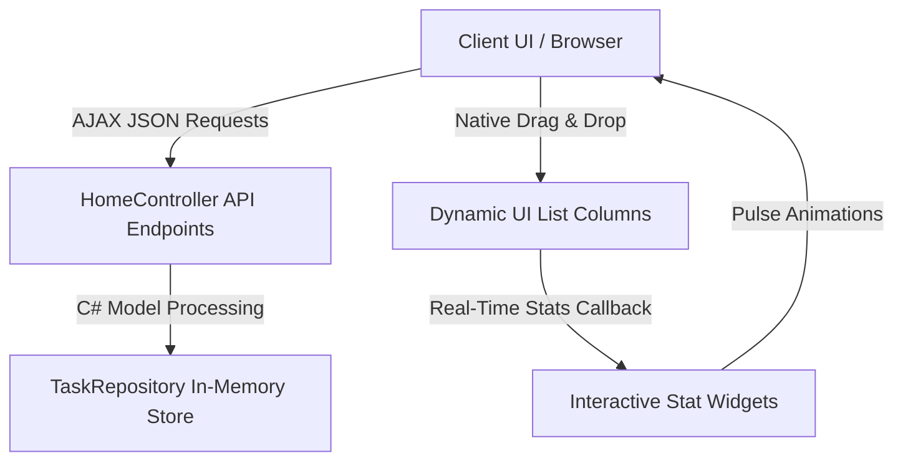

# 🌊 KanbanFlow — Premium ASP.NET Core MVC Kanban Board

[](https://dotnet.microsoft.com/)
[](https://learn.microsoft.com/aspnet/core)
[](https://opensource.org/licenses/MIT)

**KanbanFlow** is a modern, high-end, responsive task and project management dashboard application built on the robust **ASP.NET Core MVC** (.NET 9) framework. Featuring a state-of-the-art Glassmorphic user interface, smooth animations, native Drag-and-Drop capabilities, and a fully reactive asynchronous C# backend integration.

---

## ✨ Features

*   **🎨 Premium Glassmorphic UI/UX:** Styled using curated HSL color variables, sophisticated dark mode layouts, high-end translucent background cards (`backdrop-filter`), and micro-interactions.
*   **🌓 Seamless Dark & Light Mode:** An elegant, native Javascript theme switcher that saves user preferences locally (`LocalStorage`) and prevents white flashbang flickers during loading.
*   **⚡ Native HTML5 Drag-and-Drop:** Smooth drag-and-drop mechanics to seamlessly transition tasks between different workflow columns.
*   **⚙️ Real-time AJAX Synchronization:** Fully connected frontend and backend utilizing asynchronous `fetch` calls. All CRUD events (Create, Move, Delete) persist instantly to the server.
*   **📊 Interactive Metrics Panel:** A dynamic statistics row at the top showcasing task ratios and counts with real-time numeric pulsing animations.
*   **🏷️ Structured Priorities:** Color-coded priority tags (Low 🟢, Medium 🟡, High 🔴) for immediate workflow organization.

---

## 🛠️ Technology Stack

*   **Backend Framework:** ASP.NET Core MVC (.NET 9.0)
*   **Frontend Logic:** Vanilla Javascript (ES6+) with Async/Await Fetch API
*   **Design System:** CSS Custom Properties (Variables), Google Fonts (*Outfit* & *Plus Jakarta Sans*), and Bootstrap Icons
*   **Responsive Framework:** Bootstrap 5.3 (Layout structure & components)

---

## 📐 Architecture & Flow



---

## 🚀 Getting Started

### Prerequisites
*   [.NET 9.0 SDK](https://dotnet.microsoft.com/en-us/download/dotnet/9.0) or higher.
*   A modern web browser supporting ES6.

### Installation & Run

1.  **Clone the Repository**
    ```bash
    git clone https://github.com/sebastianvasquezechavarria1234/app-mvc.git
    cd app-mvc
    ```

2.  **Navigate into the Project Folder**
    ```bash
    cd MiAppMVC
    ```

3.  **Restore Dependencies and Build**
    ```bash
    dotnet restore
    dotnet build
    ```

4.  **Run the Project Locally**
    ```bash
    dotnet run
    ```
    *The console output will display the localhost URL (usually `https://localhost:7289` or `http://localhost:5289`). Open it in your browser to explore the dashboard!*

---

## 📁 Repository Structure

```text
app-mvc/
├── MiAppMVC/
│   ├── Controllers/
│   │   └── HomeController.cs     # Main C# backend API controller
│   ├── Models/
│   │   ├── TaskItem.cs           # Task data structure model
│   │   └── TaskRepository.cs     # Session repository and seed data
│   ├── Views/
│   │   ├── Home/
│   │   │   └── Index.cshtml      # Premium Kanban layout view
│   │   └── Shared/
│   │       └── _Layout.cshtml    # Global premium theme template
│   └── wwwroot/
│       ├── css/
│       │   └── site.css          # Design system, themes & animations
│       └── js/
│           └── site.js           # Drag-and-Drop & Async CRUD API client
└── README.md                     # Documentation
```

---

## 📄 License
Distributed under the MIT License. See `LICENSE` or file headers for details.
